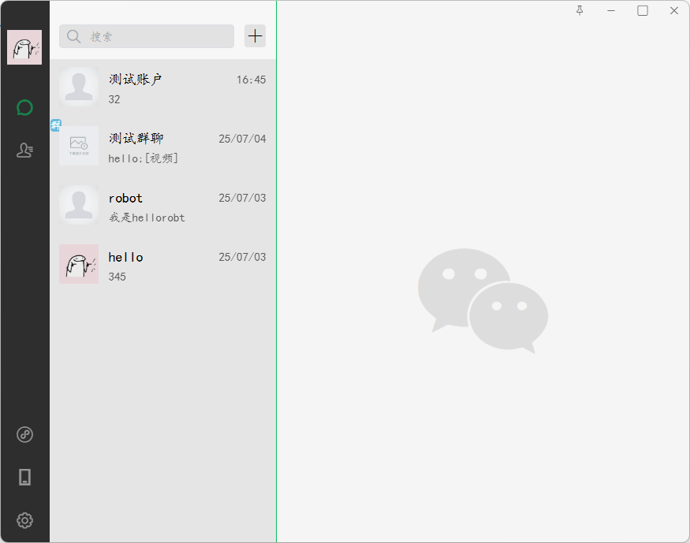
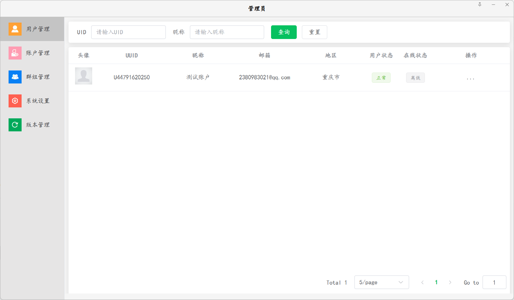

# SwiftChat-Client

<div align="center">   <h3>🚀 基于 Electron + Vue 的桌面聊天应用</h3>   <p>一个现代化的跨平台桌面聊天客户端，仅供学习交流使用</p>

## ✨ 特性

- 🖥️ **跨平台支持** - 支持 Windows、macOS 和 Linux
- ⚡ **现代化架构** - 基于 Electron + Vue 3 构建
- 🎨 **优雅界面** - 响应式设计，流畅的用户体验
- 🔧 **开发友好** - 集成 ESLint、Prettier 等开发工具
- 📦 **易于部署** - 支持一键打包为桌面应用

## 📋 系统要求

- Node.js >= 16.0.0
- npm >= 8.0.0
- 操作系统：Windows 10+、macOS 10.15+、Ubuntu 18.04+

## 🚀 快速开始

### 安装依赖

```bash
# 克隆项目
git clone [your-repo-url]
cd chat-client

# 安装依赖
npm install
```

### 开发模式

```bash
# 启动开发服务器
npm run dev
```

### 构建应用

```bash
# Windows 平台
npm run build:win

# macOS 平台  
npm run build:mac

# Linux 平台
npm run build:linux
```

## 🛠️ 推荐开发环境

为获得最佳开发体验，推荐使用以下 IDE 配置：

- **VSCode** - 主要编辑器
- **ESLint** - 代码质量检查
- **Prettier** - 代码格式化
- **Volar** - Vue 3 语言支持

## 📁 项目结构

```
chat-client/
├── src/                    # 源代码目录
│   ├── main/              # 主进程代码
│   ├── renderer/          # 渲染进程代码
│   │   ├── components/    # Vue 组件
│   │   ├── views/         # 页面视图
│   │   ├── store/         # 状态管理
│   │   └── utils/         # 工具函数
│   └── assets/            # 静态资源
├── build/                 # 构建配置
├── dist/                  # 构建输出
└── package.json           # 项目配置
```

## 🔧 技术栈

- **前端框架**: Vue 3
- **桌面框架**: Electron
- **构建工具**: Vite
- **代码规范**: ESLint + Prettier
- **包管理器**: npm

## 📸 效果图

> 🚧 待补充应用截图和功能演示
>
> 
>
> 
>
> 


## 🎯 开发计划
- [✔] 基础聊天功能
- [✔] 文件传输支持
- [✔] 群组聊天
- [✔] 表情包支持
- [✔] 截图发送

## 贡献指南

1. Fork 本仓库
2. 创建特性分支 (`git checkout -b feature/AmazingFeature`)
3. 提交更改 (`git commit -m 'Add some AmazingFeature'`)
4. 推送到分支 (`git push origin feature/AmazingFeature`)
5. 开启 Pull Request

## 📄 许可证

**⚠️ 重要声明：非商业使用许可**

本项目采用严格的非商业许可证，具体条款如下：

### 🚫 禁止商业使用

- ❌ **严禁商业使用** - 不得将本项目用于任何商业目的
- ❌ **禁止商业分发** - 不得以营利为目的分发本软件
- ❌ **禁止商业修改** - 不得基于本项目开发商业产品
- ❌ **禁止商业授权** - 不得将本项目代码用于商业授权

### ✅ 允许的使用场景

- ✅ **个人学习** - 用于编程学习和技术研究
- ✅ **教育用途** - 用于教学演示和学术研究
- ✅ **开源贡献** - 参与开源项目改进和完善
- ✅ **非营利组织** - 非营利组织的内部使用

### 📋 使用条件

1. **保留版权信息** - 必须在所有副本中保留版权声明
2. **注明修改** - 如有修改需明确标注修改内容
3. **开源分享** - 基于本项目的衍生作品必须开源
4. **免责声明** - 使用本软件的风险由用户自行承担

### ⚖️ 法律责任

违反本许可证的任何商业使用行为，作者保留追究法律责任的权利。

------

## 👨‍💻 作者信息

**学习目的声明**: 本项目纯属个人学习项目，用于探索 Electron + Vue 技术栈，不涉及任何商业目的。

如有技术问题或建议，欢迎通过 Issue 交流讨论。

------

<div align="center">   <p>⭐ 如果这个项目对你的学习有帮助，请给个 Star 支持一下！</p>   <p><strong>请注意：本项目仅供学习交流，严禁商业使用</strong></p> </div>
